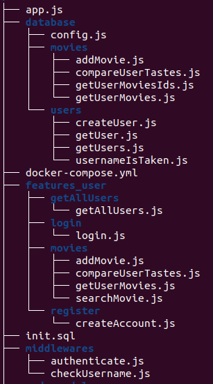

# WORKSHOP_API

## C'est quoi une api

- **Api** veut dire Application programming interface (interface de programmation d’application en français).
- L’api permet d’accéder à des services (données ou fonctionnalités) d’un système tiers.
Cela permet de faire dialoguer facilement des applications.
La plupart des API sont des api serveurs.
Une api est accessible à partir d’une adresse à laquelle on va faire des requêtes.

### Exemple:

Le front (affichage) d’un site web est **consommateur du service**. Il utilise l’api qui est **producteur du service**.
Le front peut-être l’affichage d’une boutique de chaussures, elle demande à l’api quels chaussures sont en vente, l’api envoie au front ces informations avec un titre, une description, un prix.
On utilise souvent le format json pour envoyer et recevoir des données avec des api:

https://www.lemondeinformatique.fr/actualites/lire-focus-sur-json-le-format-star-des-echanges-de-donnees-76951.html

``` json
"response": {
        "shoes": [
          {
            "title": "Chaussures de sport",
            "description": "Confortables et légères pour la course.",
            "price": "79.99"
          },
          {
            "title": "Chaussures habillées",
            "description": "Élégantes pour les occasions formelles.",
            "price": "149.99"
          }
        ]
      }
```

Ou encore
Une api propose l’utilisation d’une ia qui va indiquer si un commentaire est positif ou négatif
On envoie à l’api:
``` json
"data": {
          "comment": "J'adore ce produit, il est vraiment fantastique!"
        }
```
L'api répond
``` json
"response": {
        "sentiment": "positif",
        "confidence": 0.98
      }
    }
```

## Objectif

Faire une api avec express pour une application mobile.

## Configuration du projet

Suivez les étapes du README pour configurer le projet.
L’application doit se lancer sur l’écran pour s’enregistrer et se connecter.
Et la base de données doit être lancée avec docker.

## Développer l’API:


**1 Aller dans le dossier API**

``` sh
cd API
```

**2 Initialiser le projet**
``` sh
npm init -y
```

**npm:**
"Node Package Manager", est un gestionnaire de paquets pour Node.js. Il est utilisé pour gérer les dépendances de projets JavaScript, permettant aux développeurs de partager et de réutiliser du code

**3 Installer express**
``` sh
npm install express
``` 

**express** est un framework pour Node.js qui permet de créer une api facilement.

Vous constater que cela a créer un package.json. cat package.json pour plus d’informations.
vous pouvez rajouter la ligne “start” ici, ça lancera votre api avec npm start. Ça lancera simplement votre fichier app.js
`
"scripts": {
"start": "node app.js"
},
`

**4 Ajouter le fichier principal de l’api**
``` sh
touch app.js
```
Je vais vous montrer comment faire une api basique, vous pouvez essayer de sauter des étapes ou faire plus simple si cela vous dit.

**5 Configurer l’api**
L’api se lancera à partir de l’adresse de la machine. Si vous la lancez depuis votre ordinateur, vous pouvez y accéder localement via http://localhost
Vous devez renseigner sur quel port l’api écoute. On va choisir le port 8080.

On ajoute d’abord express
``` javascript
const express = require('express');
```

Notre app utilise express, on renseigne le port, on ajoute une route ‘/’ qui désigne la page principal de notre api avec la méthode get.
Enfin l’app écoute sur le port.

Il existe plusieurs méthode pour effectuer des requêtes api “get, post, put, delete”
``` javascript
const app = express();
const port = 8080;

app.get('/', (req, res) => {
res.send('Hello World!');
});

app.listen(port, () => {
console.log(`App listening at http://localhost:${port}`);
});
```

Vous pouvez lancer votre application et aller à
npm start ->
http://localhost:8080
Vous avez créer la route ‘/’
À partir de là, vous pouvez faire toutes les routes de votre application et mettre la logique à l’intérieur pour créer des utilisateurs ou se connecter ou autre. Mais on peut faire ça proprement.

**5 - 2 vous devez aussi intaller et ajouter ça (je l'explique pas ici vous pouvez regarder pourquoi sur internet)**
``` sh
npm install cors
```
``` javascript
const cors = require('cors');

app.use(cors());
app.use(express.json());
```

### Méthode propre:
On veut stocker les informations proprement
Mettre les informations de configuration dans un fichier .env
Il permet de séparer la configuration du code source. Cela inclut des informations sensibles ou spécifiques à l'environnement, telles que les clés API, les configurations de base de données, et les ports.
Un fichier .env se garde et se partage en local car il peut contenir des informations sensibles.

Vous pouvez reprendre le .env que j’ai mit au root.
On y voit le port utilisé, les informations pour se connecter à la base de donnée, un “ACCESS_TOKEN_SECRET” qui permet d’encrypter les mots de passes et une clé api pour utiliser TMDB. Vous pouvez rentrer votre clé api TMDB ici.

On utilisera dotenv pour charger ces variables:
``` javascript
npm install dotenv
require('dotenv').config({
path: `./.env`
});


const port = process.env.PORT;
```

### Méthode crado 🤮
Utiliser les variables en dur dans le code:
const port = 8080


**6 Ajouter d’autres routes:**

### Méthode propre:
On va utiliser un router et des middlewares.
Le router va gérer les routes.
Un Middleware est une fonction qui a accès à l'objet de requête (req), l'objet de réponse (res), et à la fonction next dans le cycle de requête-réponse d'une application Express.js. Chaque middleware peut exécuter du code, modifier les objets de requête et de réponse, terminer le cycle de requête-réponse, ou appeler la fonction next pour passer le contrôle au middleware suivant.

Il va traiter et vérifier si la requête peut aboutir.

Par exemple il peut vérifier si un utilisateur est bien authentifier avant de faire une requête.

Pour créer les routes:
``` sh
mkdir routes &&
touch routes/index.js
```

Dans index.js
``` javascript

const express = require('express');

const router = express.Router();

const { wrap } = require('async-middleware');
```

On utiliser le router, et wrap va envelopper les fonctions à faire pour les routes, il traitera la requête et doit gérer les cas d’erreurs.
On va faire les fonctions plus tard mais voici comment ajouter une  route:
``` javascript

router.post('/register', wrap(checkUsername), wrap(createAccount));
```

Pour créer un compte
On vérifie l’username puis on créer un compte, si l’username n’est pas valide, ça ne créera pas de compte.
Il faut exporter le router 
module.exports = router;

et l’ajouter dans app.js
``` javascript

const indexRouter = require('./routes/index');

app.use('/', indexRouter);
```


### Méthode crado 🤮
Mettre les routes en dur avec l’app comme on a fait pour afficher “Hello Worl”

**7 Ajouter de la logique**

On va vouloir communiquer avec notre base de donnée, c’est une base de donnée en PostGreSQL.
Créer un dossier database qui servira la logique pour intéragir avec la database et un dossier features_user qui servira la logique pour les fonctionnalités des utilisateurs. Créer un dossier register dans features_user. Créer un dossier middlewares. Puis créer les fichiers.js à l’intérieur.

On va créer un fichier congig.js dans database qui va nous permettre de nous connecter à la base de données.
Voici un exemple d’architecture:


Pour se connecter à la base de donnée (database/config.js)
``` javascript
require('dotenv').config({
path: `./.env`
});

let connectionParams = {
host: process.env.DB_HOST,
user: process.env.DB_USER,
password: process.env.DB_PASSWORD,
database: process.env.DB_NAME,
port: process.env.DB_PORT
};

if (process.env.DB_URL) {
connectionParams = {
connectionString: process.env.DB_URL
}
}

module.exports = connectionParams;
```


Dans les fichiers qui ont en ont besoin, on utilisera:
``` sh
npm install pg
```

``` javascript

const { Pool } = require('pg');
const config = require('../../database/config');

const pool = new Pool(config);
```

Pool est un outil pour se connecter à une base de donnée PostGreSQL.

Vous n’êtes pas obligé de faire checkUsername, checkUsername vérifiera si le nom d’utilisateur est déjà prit en base de données. Exemple:
checkUsername.js
``` javascript

const { isUsernameTaken } = require("../../database/users/usernameIsTaken");

async function checkUsername(req, res, next) {
if (await isUsernameTaken(req.body.username)) {
return res.status(400).json({ error: 'Username is already taken' });
}
next();
}

module.exports = checkUsername;
```


isUsernameTaken.js
``` javascript

const { Pool } = require('pg');
const config = require('../../database/config');

const pool = new Pool(config);

async function isUsernameTaken(username) {
return new Promise((resolve, reject) => {
pool.query(
`
SELECT 1 FROM users WHERE username = $1
`,
[username],
(error, result) => {
if (error) {
reject(error);
} else {
resolve(result.rowCount > 0);
}
}
)
});
}

module.exports = {
isUsernameTaken
};
```

Voici la fonction pour créer un utilisateur dans features_user:
``` javascript

const { createUser } = require('../../database/users/createUser');

async function createAccount(req, res) {
const { username, password } = req.body;

const user = await createUser({ username, password });

console.log(`User ${user} created`);

return res.status(201).json({
user
});
}

module.exports = createAccount;
```

Voici la fonction pour créer un utilisateur en base de donnée, on encrypt le mot de passe et on renvoie en réponse le nom de l’utilisateur.
npm install bcrypt
``` javascript

const bcrypt = require('bcrypt');

const { Pool } = require('pg');
const config = require('../../database/config');

const pool = new Pool(config);

async function createUser({
username, password
}) {
const hashedPass = await bcrypt.hash(password, 7);
return new Promise((resolve, reject) => {
pool.query(
`
INSERT INTO users
(username, password)
SELECT $1, $2
RETURNING username
`,
[username, hashedPass],
async (error, result) => {
if (error) {
reject(error);
} else {
resolve(result.rows[0].username);
}
}
)
})
}

module.exports = {
createUser
};
```


Vous pouvez tester cette route avec Postman ou l’application mobile.
Cette route pour se register utilise la méthode post. Elle va lire le “body” de la requête pour récupérer un username et un password et retourne en réponse le nom d’utilisateur.

On retourne une response et un code pour indiquer le status de la requête. En exemple une requête 403 indique que la requête n’est pas autorisé, vous pouvez vous renseigner sur les différents type de retours.


## Méthode crado 🤮<br>
Tout mettre dans une fonction dans la route.


**8 Continuer à faire des routes**<br>
Pour continuer, vous devez ajouter des fonctions pour intéragir avec la base de donnée. Puis créer des fonctions de logique qui vont traiter les requêtes, puis créer des middlewares qui vérifie l’avancé de la requête, et enfin ajouter tout ça dans une route.
Vous pouvez regarder dans le code de l’application pour vous aider à faire les routes, chercher avec ApiClient().post ou ApiClient().get
**Exemple:**
``` dart

void _login() async {
var data = {
'username': _usernameController.text,
'password': _passwordController.text,
};

try {
final response = await ApiClient().postRequest(
'/login',
data,
);

if (response.statusCode == 200) {
ApiClient().token = response.data['token'];
ApiClient().userId = response.data['id'];
if (mounted) {
_showMessage('Connexion réussie', Colors.green);
}
if (mounted) Navigator.push(context, MaterialPageRoute(builder: (context) => const HomeScreen()));
} else {
if (mounted) {
_showMessage('Nom d\'utilisateur ou mot de passe incorrect', Colors.red);
}
}
} catch (e) {
if (mounted) {
_showMessage('Erreur de connexion', Colors.red);
}
print('Error connexion: $e');
}
}
```

Ici on fait une requête avec en body ‘username’ et ‘password’ avec la méthode post à l’adresse ‘login’ on vérifie le retour de l’application.
Il faut renvoyer un token et l’id de l’utilisateur. C’est un retour 200 également quand c’est réussi.

Pour vous aider:
Vous pouvez utiliser jsonwebtoken
npm install jsonwebtoken

pour générer un token: récupérer la première ligne de openssl rand -base64 64
et metter là dans le .env à ACCESS_TOKEN_SECRET

``` javascript
const jwt = require('jsonwebtoken');
const { getUser } = require('../../database/users/getUser');
const bcrypt = require('bcrypt');
const { Pool } = require('pg');
const config = require('../../database/config');

const pool = new Pool(config);

async function login(req, res) {
const { username, password } = req.body;

const user = await getUser(username);

if (!user || !await bcrypt.compare(password, user.password)) {
return res.status(401).json({ error: 'Invalid username or password' });
}
console.log('User connected: ', user.username);
return res.status(200).json({
id: user.id,
username: user.username,
token: jwt.sign({ username: user.username, id: user.id }, process.env.ACCESS_TOKEN_SECRET, { expiresIn: '1h' })
});
}

module.exports = login;
```


**9 Intégrer TMDB:**<br>
Vous pouvez faire des calls api dans votre api.
On récupère la clé, on regarde la documentation de l’api de TMDB et on fait les requêtes
``` javascript
const TMDB_API_KEY = process.env.TMDB_API_KEY;

async function getMovieDetails(tmdbId) {
const url = `https://api.themoviedb.org/3/movie/${tmdbId}?api_key=${TMDB_API_KEY}`;
try {
const response = await axios.get(url);
return response.data;
} catch (error) {
console.error(`Error fetching movie details for TMDB ID ${tmdbId}:`, error);
throw error;
}
}
```

Vous pouvez ajouter des fonctionnalités complémentaires, par exemple ajouter des amis, il y a une table friendship en db.
